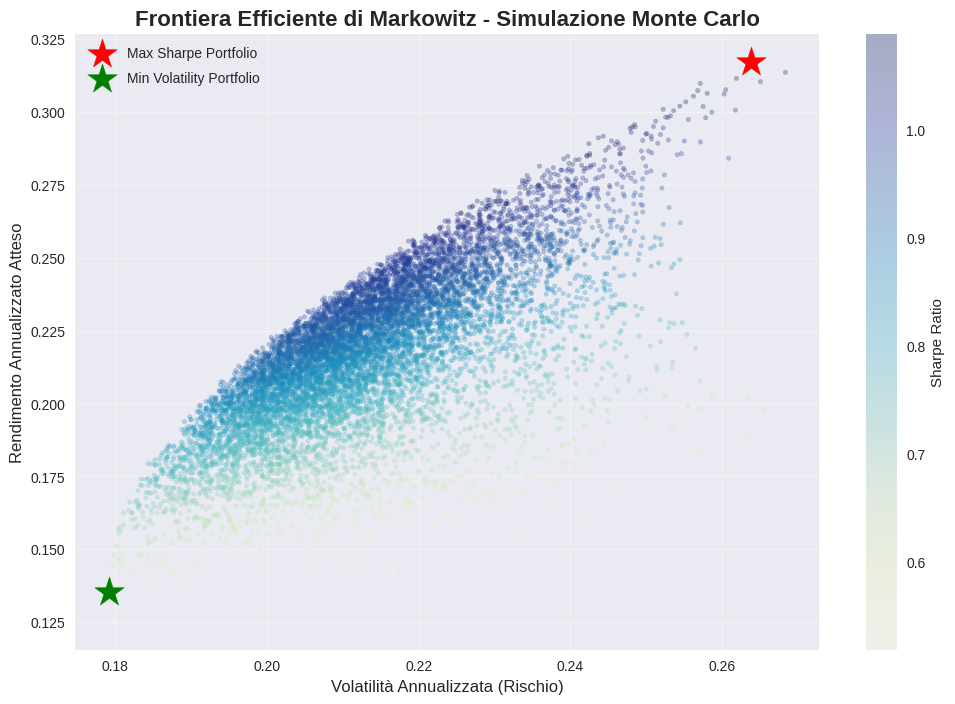

# Quantitative Risk & Portfolio Optimization Engine 📈

## Descrizione del Progetto
Engine quantitativo sviluppato in Python per l'ottimizzazione dell'asset allocation e la gestione del rischio di portafoglio. Basato sulla **Modern Portfolio Theory (MPT)** di Markowitz e sull'analisi dei rischi estremi.

## Struttura del Repository
- `notebooks/`: Notebook Jupyter/Colab con il codice completo ed eseguibile.
- `images/`: Grafici generati dall'analisi (Frontiera Efficiente).

## Funzionalità Principali
- **Data Ingestion:** Download automatizzato di serie storiche rettificate via `yfinance`.
- **Ottimizzazione Markowitz:** Simulazione Monte Carlo (10.000 scenari) per identificare il *Max Sharpe Portfolio* e il *Min Volatility Portfolio*.
- **Risk Metrics:** Calcolo di Volatilità annualizzata, Maximum Drawdown, Value at Risk (**VaR**) e Conditional VaR (**CVaR**) al 95% e 99%.

## Risultati dell'Ottimizzazione

## Come Replicare l'Analisi
1. Clona il repository: `git clone https://github.com/ivyleagueproject28-lang/Quant-Risk-Engine.git`
2. Installa le dipendenze: `pip install -r requirements.txt`
3. Apri il notebook presente in `notebooks/` su Google Colab o Jupyter.
# Quantitative Risk & Portfolio Optimization Engine 📈

## 🚀 Live Demo & Risorse
- **Web App Interattiva:** [Quant Portfolio Engine su Streamlit Cloud](https://quant-risk-engine-akcvnqgtk6jxjfcrg3dcsr.streamlit.app/)
- **Report Tecnico (PDF):** Disponibile nella documentazione del repository.

## Descrizione del Progetto
Engine quantitativo sviluppato in Python per l'ottimizzazione dell'asset allocation e la gestione del rischio di portafoglio. Basato sulla **Modern Portfolio Theory (MPT)** di Markowitz e sull'analisi dei rischi estremi.
